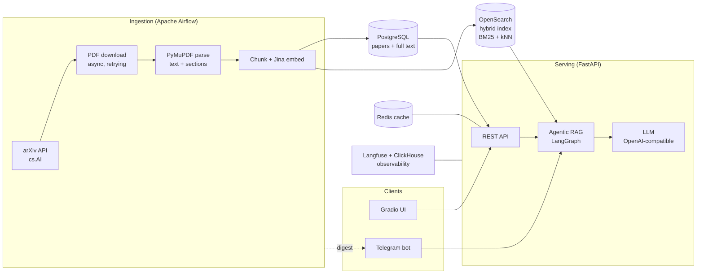

# arXiv Paper Curator

<div align="center">
  <h3>An agentic RAG research assistant for arXiv papers</h3>
  <p>Automatically fetches CS.AI papers, parses and indexes them for hybrid search, and answers research questions with a grounded, self-correcting RAG pipeline.</p>
</div>

<p align="center">
  
  
  
  
  
  
</p>

<p align="center">
  
</p>

---

## Overview

The **arXiv Paper Curator** is a production-style Retrieval-Augmented Generation (RAG) system that turns the daily stream of arXiv `cs.AI` papers into a searchable, question-answerable knowledge base.

The system runs an automated ingestion pipeline that fetches new papers, downloads and parses their PDFs, chunks and embeds the text, and indexes everything into a hybrid search engine. On top of that sits a RAG API and an **agentic** workflow that validates queries, retrieves and grades evidence, self-corrects weak retrievals, and generates grounded answers with citations. Users can query it through a REST API, a Gradio chat UI, or a conversational Telegram bot.

Everything runs locally via Docker Compose, with production overrides, self-hosted observability, and CI/CD support.

---

## Architecture



**Two main flows:**

1. **Ingestion (batch, orchestrated by Airflow)** — On a weekday schedule, fetch new papers → download PDFs concurrently → parse with PyMuPDF → store metadata + full text in PostgreSQL → chunk, embed with Jina, and index into OpenSearch → generate a daily report → push a Telegram digest.
2. **Serving (online, FastAPI)** — Hybrid search + RAG answering, including a LangGraph agentic workflow, streaming responses, a Gradio UI, and a Telegram bot. Redis caches responses, and Langfuse traces every LLM call.

<p align="center">
  
</p>

---

## Technology Stack

| Layer | Technology | Role |
|-------|-----------|------|
| **API** | FastAPI + Uvicorn (async) | REST endpoints, streaming, auto docs |
| **Orchestration** | Apache Airflow 2.10 | Daily ingestion DAG |
| **Database** | PostgreSQL 16 + SQLAlchemy + Alembic | Paper metadata, parsed full text, sections, references |
| **Search** | OpenSearch 2.19 | Hybrid index (BM25 + kNN vectors) with RRF fusion |
| **Embeddings** | Jina AI `embeddings-v3` (1024-dim) | Passage/query embeddings for semantic search |
| **PDF parsing** | PyMuPDF | Fast, page-bounded text + section extraction |
| **LLM** | Any OpenAI-compatible Chat Completions provider | Answer generation, guardrail, grading, query rewrite |
| **Agentic workflow** | LangGraph | Guardrail → retrieve → grade → rewrite → generate |
| **Cache** | Redis 7 | Response caching + Telegram leader election |
| **Observability** | Langfuse v2 (+ dedicated Postgres, ClickHouse) | LLM tracing and analytics |
| **Interfaces** | Gradio, python-telegram-bot | Chat UI and conversational bot |
| **Tooling** | UV, Ruff, MyPy, Pytest (+ Testcontainers), pre-commit | Dependency mgmt, linting, typing, testing |
| **Packaging** | Docker Compose (local + prod overrides) | Multi-service orchestration |

---

## What's Implemented

### Automated data ingestion
- **Airflow DAG** (`arxiv_paper_ingestion`) scheduled Monday–Friday at 06:00 UTC, modularized into `setup → fetch → index → report → notify → cleanup` tasks.
- **arXiv API client** for the `cs.AI` category with rate limiting, configurable result caps, and retrying.
- **Concurrent PDF downloads** with bounded parallelism and exponential-backoff retries.
- **PyMuPDF parser** that bounds memory/time by only reading up to `max_pages`, extracting raw text, sections, and references.
- **Idempotent storage** in PostgreSQL with parser metadata and processing flags.

### Hybrid search & indexing
- **Single OpenSearch hybrid index** combining lexical **BM25** and **kNN vector** search, fused with a **Reciprocal Rank Fusion (RRF)** search pipeline.
- **Section-aware text chunking** (default 600 words, 100-word overlap) at the chunk level for precise retrieval.
- **Jina embeddings v3** (1024-dim, cosine similarity) for both indexing passages and query embedding.
- Automatic index bootstrap on API startup (creates the hybrid index if missing).

### RAG & agentic answering
- **`/ask`** — classic RAG: retrieve top-k chunks → generate a grounded answer with sources.
- **`/stream`** — streaming RAG responses.
- **`/ask-agentic`** — a **LangGraph** state machine that:
  1. **Guardrail** — scores query relevance to the research domain (0–100) and rejects out-of-scope questions.
  2. **Retrieve** — hybrid or BM25 search (graceful fallback if embeddings fail).
  3. **Grade documents** — an LLM judges whether retrieved chunks can answer the query.
  4. **Rewrite & retry** — refines the query and re-retrieves, bounded by a max-attempts budget.
  5. **Generate answer** — produces a grounded answer and returns the full reasoning trace.
- Fail-open design at every LLM step so a transient error never crashes a request.

### Interfaces
- **Gradio chat UI** for interactive querying.
- **Telegram bot** with conversational Q&A (routed through the agentic workflow), per-user access control, and **Redis-based leader election** so exactly one Uvicorn worker runs the bot.
- **Telegram ingestion digest** that pushes a summary of newly crawled papers after each pipeline run.

### Observability & caching
- **Self-hosted Langfuse** (with its own Postgres and ClickHouse) tracing LLM calls end to end.
- **Redis caching** of responses with configurable TTL.

### Operations
- **Docker Compose** for the full local stack, plus `compose.prod.yml` production overrides.
- **Makefile** targets for local and production workflows, health checks, and dev tooling.
- CD configuration and push-based Airflow notifications.

---

## Quick Start

### Prerequisites
- **Docker Desktop** (with Docker Compose)
- **Python 3.12**
- **UV Package Manager** ([install guide](https://docs.astral.sh/uv/getting-started/installation/))
- **8GB+ RAM** and **20GB+ free disk space**

### Run

```bash
# 1. Clone and install dependencies
git clone <repository-url>
cd research-paper-curator
uv sync

# 2. Configure environment (LLM provider, Jina key, etc.)
cp .env.example .env   # then edit .env

# 3. Start the full stack
make start             # or: docker compose up --build -d

# 4. Verify the API is healthy
curl http://localhost:8000/api/v1/health
```

### Services

| Service | URL | Purpose |
|---------|-----|---------|
| **API Docs** | http://localhost:8000/docs | Interactive API (Swagger) |
| **Airflow** | http://localhost:8080 | Ingestion pipeline (default `admin` / `admin`) |
| **OpenSearch Dashboards** | http://localhost:5601 | Search engine UI |
| **Langfuse** | http://localhost:3000 | LLM observability |
| **Gradio UI** | via `uv run python -m src.gradio_app` | Chat interface |

Internal services: PostgreSQL (`5432`), Redis (`6379`), OpenSearch (`9200`), ClickHouse & Langfuse Postgres.

---

## API Endpoints

All endpoints are prefixed with `/api/v1`.

| Method | Endpoint | Description |
|--------|----------|-------------|
| `GET` | `/health`, `/ping` | Service health checks |
| `GET` | `/papers/` | List / search papers |
| `GET` | `/papers/{arxiv_id}` | Fetch a single paper by arXiv ID |
| `POST` | `/hybrid-search/` | Hybrid (BM25 + vector) search over chunks |
| `POST` | `/ask` | RAG question answering with sources |
| `POST` | `/stream` | Streaming RAG responses |
| `POST` | `/ask-agentic` | Agentic RAG (guardrail + grading + self-correction) |

---

## Project Structure

```
research-paper-curator/
├── src/
│   ├── main.py                 # FastAPI app + lifespan wiring (services, Telegram leader lock)
│   ├── config.py               # Pydantic settings (nested, env-driven)
│   ├── gradio_app.py           # Gradio chat UI
│   ├── routers/                # papers, hybrid-search, ask, stream, ask-agentic, health
│   ├── models/                 # SQLAlchemy models (Paper)
│   ├── repositories/           # Data access layer
│   ├── schemas/                # Pydantic schemas (api, arxiv, embeddings, indexing, pdf_parser, llm)
│   ├── db/                     # Database factory + interfaces
│   └── services/
│       ├── arxiv/              # arXiv API client
│       ├── pdf_parser/         # PyMuPDF parser
│       ├── indexing/           # Text chunker + hybrid indexer
│       ├── embeddings/         # Jina embeddings client
│       ├── opensearch/         # Client, query builder, hybrid index config
│       ├── llm/                # OpenAI-compatible LLM client + prompts
│       ├── agents/             # LangGraph agentic RAG (graph, nodes, state, prompts)
│       ├── cache/              # Redis cache client
│       ├── langfuse/           # Observability tracer
│       └── telegram/           # Telegram bot + ingestion notifier
│
├── airflow/
│   ├── dags/
│   │   ├── arxiv_paper_ingestion.py    # DAG definition
│   │   └── arxiv_ingestion/            # setup, fetching, indexing, reporting, notify
│   ├── Dockerfile
│   └── entrypoint.sh
│
├── tests/                      # Test suite (Pytest + Testcontainers)
├── static/                     # Architecture diagrams & assets
├── compose.yml                 # Local service orchestration
├── compose.prod.yml            # Production overrides
├── Makefile                    # Local + production workflows
└── pyproject.toml              # Dependencies (managed by UV)
```

---

## Commands

```bash
make help          # List all available commands

# Local stack
make start         # Build & start all services
make stop          # Stop all services
make restart       # Restart services
make status        # Show service status
make logs          # Tail logs
make health        # Check health of API, OpenSearch, Airflow
make clean         # Stop and remove volumes

# Production (compose.prod.yml overrides)
make prod-start    # Build & start with production overrides
make prod-stop
make prod-logs

# Development
make setup         # uv sync
make format        # ruff format
make lint          # ruff check --fix + mypy
make test          # pytest
make test-cov      # pytest with coverage report
```

---

## Configuration

Configuration is driven by environment variables (loaded from `.env`) via Pydantic settings, using a nested `SECTION__KEY` convention. Key groups:

| Prefix | Purpose |
|--------|---------|
| `POSTGRES_*`, `OPENSEARCH__*` | Database and search connections |
| `ARXIV__*` | Fetch category, rate limits, concurrency, retries |
| `PDF_PARSER__*` | Max pages / file size bounds |
| `CHUNKING__*` | Chunk size, overlap, section-based chunking |
| `LLM_*`, `JINA_API_KEY` | LLM provider (OpenAI-compatible) and embeddings |
| `REDIS__*` | Cache host and TTL |
| `LANGFUSE__*` | Observability keys and host |
| `TELEGRAM__*` | Bot token, access control, ingestion digest |

---

## Troubleshooting

- **Services not starting?** Give the stack 2–3 minutes on first boot; check `docker compose logs`.
- **Port conflicts?** Free ports `8000`, `8080`, `5432`, `9200`, `5601`, `3000`, `6379`.
- **Memory issues?** Increase Docker Desktop's memory allocation (OpenSearch + Langfuse are memory-hungry).
- **Search returns nothing?** Confirm the ingestion DAG has run and the OpenSearch hybrid index is populated.
- **Full reset:** `make clean` (or `docker compose down --volumes && docker compose up --build -d`).

---

## License

MIT License — see [LICENSE](LICENSE) for details.
